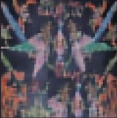
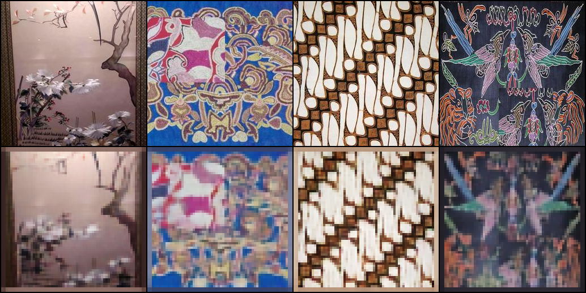
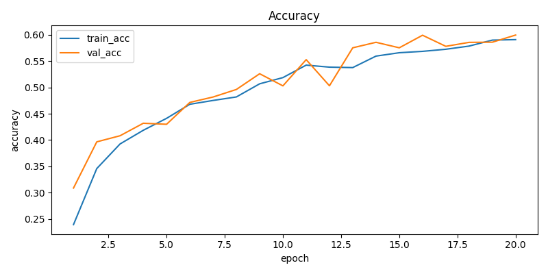
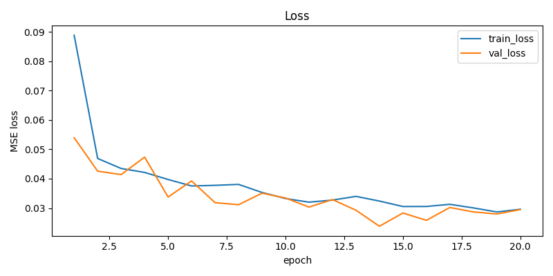

# Multimodal Latent Diffusion for Embroidery Design Generation

This repository contains the implementation and experimental results of a **Multimodal Latent Diffusion Framework** for **text-to-image** and **image-to-image embroidery design generation**.  
The project focuses on **cultural textile preservation**, **seamless pattern generation**, and **AI-assisted embroidery design**.

---

## 📄 Research Paper

The full methodology, architecture, experiments, and analysis are documented in the research paper:

📘 **Multimodal Latent Diffusion Framework for Text-to-Image and Image-to-Image Embroidery Design Generation**

📄 File: `gen-project.pdf`

---

## 📁 Repository Structure (Main Branch)

All files are stored directly in the `main` branch root:

- `gen-project.pdf` – Full research paper  
- `gen-project-part-1.ipynb` – Dataset preparation, captioning, and VAE training  
- `gen-project-part-2.ipynb` – Latent diffusion training and generation  
- `embroidery_dataset.zip` – Cultural embroidery image dataset  
- `caption_dataset.zip` – Auto-generated caption dataset  
- `model.zip` – Trained model checkpoints  
- `architecture.png` – Complete architecture diagram  
- `pretrain_epoch_50.png` – VAE pretraining reconstruction results  
- `text2img_samples.png` – Text-to-image generation samples  
- `ldm_acc.png` – Latent diffusion training accuracy  
- `loss_curve.png` – Training loss curves  

---

## 🧠 Architecture Overview

The proposed framework integrates **Texture-VAE**, **Vision–Language modeling**, and **Latent Diffusion** in a unified multimodal pipeline.

### Overall Architecture

The architecture consists of three main training phases:

- **Phase A:** Texture-VAE Pretraining with Seam Consistency Loss  
- **Phase B:** Adversarial Finetuning of the VAE Decoder  
- **Phase C:** Multimodal Latent Diffusion Model Training  

This design enables seamless, tileable embroidery generation with strong cultural and textual alignment.

---

## 🧵 Generation Tasks

### 1. Text-to-Image Embroidery Generation

The model generates embroidery patterns directly from natural language prompts describing cultural styles, motifs, textures, and color palettes.

#### Sample Results

The prompts corresponding to these samples are documented in the research paper.

---

### 2. Image-to-Image Embroidery Generation

The framework also supports image-conditioned generation, allowing creative variations of existing embroidery patterns while preserving core stylistic and cultural characteristics.

---

## 📊 Training and Evaluation Results

### Texture-VAE Pretraining

The following figure shows reconstruction quality after **50 epochs** of VAE pretraining with seam consistency loss:

This demonstrates effective texture preservation and seamless tiling behavior.

---

### Latent Diffusion Model Performance

Training accuracy of the latent diffusion model over epochs:

The model shows stable convergence and effective multimodal conditioning.

---

### Training Loss Curves

---

## 📂 Datasets

### Embroidery Dataset
📦 `embroidery_dataset.zip`

Includes cultural embroidery patterns from:
- African fabrics
- Guizhou (Chinese) embroidery
- Indonesian Batik motifs

All images are resized to 256×256 and normalized for diffusion training.

---

### Caption Dataset
📦 `caption_dataset.zip`

- Captions automatically generated using **LLaVA-1.5-7B**
- Enables text-conditioned generation without manual annotations

---

## 🧠 Model Checkpoints

📦 `model.zip`

Contains:
- Pretrained Texture-VAE
- Adversarially refined decoder
- Multimodal latent diffusion model weights

---

## 📓 Notebooks

### `gen-project-part-1.ipynb`
- Dataset loading and preprocessing  
- Automated caption generation  
- Texture-VAE training with seam consistency  

### `gen-project-part-2.ipynb`
- Multimodal latent diffusion training  
- Text-to-image and image-to-image generation  
- Evaluation and visualization  

---

## 🛠️ Technologies Used

- Python
- PyTorch
- Latent Diffusion Models
- Transformers
- LLaVA-1.5-7B
- Variational Autoencoders (VAE)
- Patch Transformer Conditioning

---

## 🚀 Applications

- AI-assisted embroidery and textile design
- Cultural heritage preservation
- Seamless textile pattern generation
- Fashion and fabric prototyping
- Research and academic experimentation

---

## ⚠️ Limitations

- Fine stitch details are limited at 256×256 resolution  
- Rare cultural motifs may be underrepresented  
- Direct embroidery machine stitch instructions are not generated  

---

## 🔮 Future Work

- Higher resolution generation (512×512, 1024×1024)  
- Expanded cultural datasets  
- Interactive editing and inpainting  
- Stitch-level sequence prediction  
- Real-time inference optimization  

---

## 📄 Citation

If you use this work in your research, please cite:

**Multimodal Latent Diffusion Framework for Text-to-Image and Image-to-Image Embroidery Design Generation**  
Sami Naeem  
FAST–NUCES Islamabad

---

## 📜 License

This project is intended for **academic and research use only**.  
Please review dataset licenses before any commercial use.

---

## 🤝 Acknowledgements

- LLaVA project for vision–language caption generation  
- Open-source diffusion research community  
- Cultural embroidery dataset contributors  
